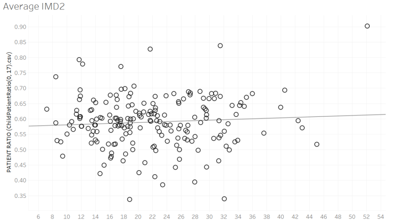

## 👨 Welcome to Xiaoyu's Pages

<table border="0">
  <tr>
    <td width="75%">
      <h1> Xiaoyu Mu</h1>
      <p><b>- 👋Hi, I’m Xiaoyu Mu, a postgraduate of University of Leeds.</b></p>
      <p><b>- 👀 I’m interested in watching films, programming, running, sharing my life...</b></p>
      <p><b>- 💞️ I’m looking to a good job.</b></p>
      <p><b>- 🌱 I’m currently learning Advanced Computer Science.</b></p>
      <p><b>- 📫 How to reach me:  xiaoyu_fish@outlook.com</b></p>
    </td>
    <td width="25%">
            
    </td>
  </tr>
</table>


### 🎓 Education
09/2021-09/2022   MSc in Advanced Computer Science, University of Leeds


09/2017-07/2021   BSc in Computer Science, Yantai University

### 🛠 Tech Stack

- 💻 &nbsp; Python | C | Java | C++ | SQL 
- 🌐 &nbsp; Android | HTML | CSS | JavaScript 
- 🛢 &nbsp; MySQL 
- 🔧 &nbsp; PyCharm | Visual Studio code | Eclipse | Linux | Jupyter | Tableau
 
### Awards

- Excellent bachelor’s degree thesis of College (top 2%), Yantai University, 2021
- School-level outstanding graduate awards (top 2%), Yantai University, 2021
- The Outstanding Student Scholarship (top 8%), Yantai University, 2020
- The Xinde Enterprise Encouragement Scholarship (top 2%), Yantai University, 2019
- The National Second Prize of ASC International Student CS Challenge, China, 2019
- The Third Prize of Blue Bridge Cup Coding Competition, Shandong, China, 2019
- The Third Prize of Provincial Mathematics Competition, Shandong, China, 2018
- The Golden Dragon Enterprise Scholarship (top 4%), Yantai University, 2018

### Projects
11/2021-12/2021  Group Project - Data Analysis with Python, University of Leeds
- Skills in Python, Matplotlib Method to draw different graphs.
- Analyse and visualise data in the CSV files, and explain the cause and result of the problem according to data features and trends.
```
def pltcorrCO2GDP(co2,gdp,area):

    plt.plot(co2.keys(), co2.values())

    # Label the axes
    plt.xlabel('Year')
    plt.ylabel(co2data['Indicator Name'].iloc[0])

    #label the figure
    plt.title('CO2 Emissions and GDP per capita in '+area)

    #set x axis ticker
    ax = plt.gca()
    ax.xaxis.set_major_locator(ticker.MultipleLocator(base=8))

    #plot gdp data
    ax1=ax.twinx()
    ax1.plot(gdp.keys(),gdp.values(),'r')
    ax1.set_ylabel(gdpdata['Indicator Name'].iloc[0])
    ax1.xaxis.set_major_locator(ticker.MultipleLocator(base=8))

    plt.show()
```


11/2021-12/2021  Group Project - Analysis Case Study, University of Leeds
- Skills in Tableau, visualise data using Tableau.
- Analyse data about NHS Dental Statistics for England for 12 months.



11/2020-06/2021  Final Year Project - Recognition Circular Pattern Plane Target Based on Graph Algorithm, Yantai University
- Skills in C++, Clustering, Graph Theory, Calibrate Camera, Convex Algorithms,Homography Matrix Algorithms, Shortest Distance Algorithms.
- Take pictures of the target, identify the circles, and calculate the center of thecircles. Finally, select and order the circles. This technique is ised to calibratecamera in computer vision.

```
//image processing
cvtColor(src, gray_src, COLOR_BGRA2GRAY); 
threshold(gray_src, gray_src, 0, 255, THRESH_OTSU | THRESH_BINARY); 
Mat kernel = getStructuringElement(MORPH_RECT, Size(5, 5), Point(-1, -1)); 
morphologyEx(gray_src, dst, MORPH_CLOSE, kernel, Point(-1, -1)); 
kernel = getStructuringElement(MORPH_RECT, Size(5, 5), Point(-1, -1)); 
morphologyEx(dst, dst, MORPH_OPEN, kernel, Point(-1, -1)); 
imshow("open image", dst); 
vector <vector<Point> > contours; 
vector<Vec4i> hireachy; 
findContours(dst, contours, hireachy, RETR_TREE, CHAIN_APPROX_SIMPLE, Point());

//get Homography Matrix 
Mat h = findHomography(tubaodian, tubaodian1);//opencv function
Mat q= Mat(3, 1, CV_32FC1);
```


05/2020-06/2020  Group Project - Developing a Web Application, Yantai University
- Skills in HTML and CSS, and MySQL.
- Developed a web application for the Intelligent Home System.

``` 
//Initialize the local socket information  
$this->_init($address, $port);
$this->sockets[] = $this->master;
//Monitoring and data processing
while(true){
$sockets = $this->sockets;
var_dump($sockets);
var_dump($this->clients);
//IO multiplexing is completed with multiple clients and socket sets are obtained
$symbol = socket_select($sockets, $this->write, $this->except, NULL);
if($symbol == false){
echo"socket_select() failed,reason:".socket_strerror(socket_last_error())."\n";
die();
}
//Use socket to receive data  
foreach($sockets as $socket){
if($socket == $this->master){
$client = socket_accept($this->master);
if($client){

$this->sockets[] = $client;
$this->clients[] = array('familyNo'  => null,
'is_user'	=> false,	
'socket' => $client,
'handshake' => false);
}else{
echo "socket_accept() failed";
continue;	//processing other socket
}
}else{
//receive data
$bytes = @socket_recv($socket, $buffer, 2048 ,0);
$index = $this->_getUserIndex($socket);	//user's information
if($index == -1){continue;}
if($bytes == 0){
//Disconnect the server from the client
$this->_disConnect($socket);
//remove user
$this->_deleteUser($index);
continue;
}
if(!$this->clients[$index]['handshake']){
if($this->_doHandShake($socket, $buffer, $index)){
echo "handshake success!\n";
$msg = array(
'infoNo'=>'0',
'info'	=>"握手成功"	//Encryption problem
);	//ok
$this->_send($socket, json_encode($msg));
}else{
echo "send message\n";
//Get the data portion and decrypt it with JSON
$info = json_decode($this->_decode($buffer));

```


<h3> 🤝🏻 Connect with Me </h3>

<p align="center"> 
&nbsp; <a href="https://www.linkedin.com/in/xiaoyu-mu-b07912223/" target="_blank" rel="noopener noreferrer"></a>
&nbsp; <a href="mailto:xiaoyu_fish@outlook.com" target="_blank" rel="noopener noreferrer"></a>
</p>
